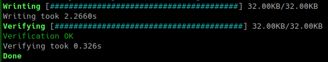

# at28c-rs

> Firmware and CLI utility to program AT28C EEPROM chips

## Instructions

This project consists of a firmware, to turn your STM32F103 (bluepill boards) in an USB programmer for the `AT28C256` and `AT28C64` parallel EEPROM chips, and a CLI utility to interface with it.

**Please be advised that the STM32F103 microcontroller works with 3.3 volts while the EEPROMs with 5 volts. This project uses the Five-volt Tolerant pins of the microcontroller to read the outputs of the EEPROM, make sure you DO NOT connect any non 5v-tolerant pin to a signal that can be bigger than the VCC you are using for the microcontroller (3.3v typical/maximum).**

**Note that this instructions use the bluepill board as an example, but be advised that a bluepill is not a real specific design, make sure you have the correct microcontroller and check the datasheets. I am not in any way to be held responsible for any problems you might have, if you do use this instructions you do so AT YOUR OWN RISK**

>Note: This was only tested on linux, but it should also work in other platforms, if you try this project in other platforms please consider telling [me](https://twitter.com/thales_fragoso) your experience.

### Prerequisites

The best way to setup the toolchain is to use `rustup`, so go ahead and [install it](https://www.rust-lang.org/tools/install). After that you can run:

```console
$ rustup target add thumbv7m-none-eabi
```

If you want to inspect the binary you will also want to run:
```console
$ cargo install cargo-binutils
$ rustup component add llvm-tools-preview
```

This project uses [cargo-make](https://crates.io/crates/cargo-make) to easily deal with the workspace with different targets:

```console
$ cargo install cargo-make
```

This is optional, you can also manually type the commands used in [Makefile.toml](Makefile.toml).

### Compilation

Simply run the following command in the workspace root:

```console
$ cargo make all
```

The resulting binaries can be found in the `target` folder, the firmware will be in `target/thumbv7-none-eabi/release/at28c-rs-firmware` and the cli utility in `target/release/at28c-rs-cli`.

### Flashing

The easiest way is if you have a debug probe compatible with [cargo-flash](https://crates.io/crates/cargo-flash), then you can just run:

```console
$ cargo install cargo-flash
$ cargo make flash
```

Note that depending of the firmware you have running on the board you will need to hold the reset button in the beginning of the flash stage.
You can also use `objcopy` in the resulting `elf` file to get a `bin` file and use that with a serial bootloader, note that if you are using a custom bootloader and if it lives in the normal program space it will be overwritten.
There are also `.gdb` and `.cfg` files in the firmware folder to be used with `openocd` and `gdb`.

### Connections

PB8 to PB15 (5v-tolerant) -> IO lines of the EEPROM

PA0 to PA10 -> A0 to A10 Addressing lines

PB3 to PB6 -> A11 to A14, if you are using the `AT28C64` you won't need all the pins

PB0 -> Output Enable

PB1 -> Write Enable

Chip Enable on the EEPROM should be tied to ground

This seems like a bad organized setup, but it was needed because of the 5v outputs and to ease some aspects of the code, we also need to leave the USB and SWD pins free.

### CLI usage

The CLI is quite simplistic, for more details:

```console
$ ./at28c-rs-cli --help
```

Writing example:

```console
$ ./at28c-rs-cli -w -d AT28C256 -f out.bin -p /dev/ttyACM0
```

Where `/dev/ttyACM0` is the port used by the bluepill when you connect it with USB, other examples are `/dev/ttyUSB0`, `COM1`, etc.

Performance:



## License

MIT license ([LICENSE](LICENSE))

## Contribution

Any contribution intentionally submitted for inclusion in the work by you shall be licensed as above, without any additional terms or conditions.
